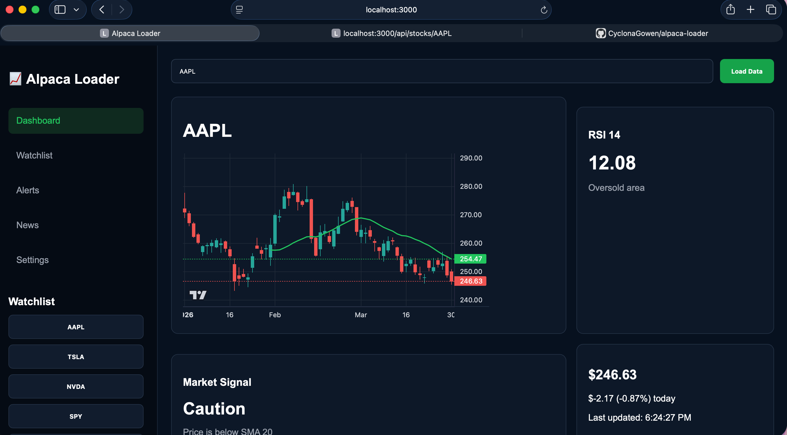

# Alpaca Loader

A Node.js stock dashboard application powered by the Alpaca Trading API.

## Features

- Live stock market data
- Candlestick chart visualization
- 20-day SMA technical indicator
- Dynamic stock ticker lookup
- Watchlist sidebar
- Browser-based dashboard UI
- Express backend API
- Alpaca Paper Trading integration

## Technologies Used

- Node.js
- Express
- Alpaca Trade API
- TradingView Lightweight Charts
- HTML/CSS/JavaScript
- dotenv

## Setup

Clone the repository:

git clone https://github.com/cycalonagowen/alpaca-loader.git

Install dependencies:

npm install

Create a .env file:

APCA_API_KEY_ID=your_key_here
APCA_API_SECRET_KEY=your_secret_here

Run the application:

node src/server.js

Open in browser:

http://localhost:3000

## Example Tickers

- AAPL
- TSLA
- NVDA
- AMD
- SPY
- QQQ

## Current Features

### Dashboard
- Responsive dark-themed UI
- Stock search
- Dynamic data loading

### Charts
- Candlestick chart
- SMA 20 indicator overlay

### Watchlist
- Quick-load sidebar buttons

### Data
- Open
- High
- Low
- Close
- Volume
- Daily price change

## Future Goals

- RSI indicator
- MACD indicator
- Live streaming market updates
- Alerts system
- Database storage
- User authentication
- Portfolio tracking
- AI trading signals
- News integration
- Mobile optimization

## Development Notes

This project began as a small Node.js command-line application for loading stock data from Alpaca and evolved into a browser-based trading dashboard.

Refactored frontend JavaScript out of index.html into public/app.js.
This makes the project easier to maintain.